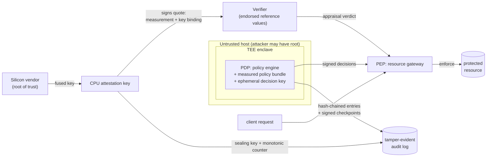

# VERITY — Zero Trust + Confidential Computing

*Zero Trust decisions you can cryptographically trust.*

A minimalist, end-to-end demonstration — pure Go, **zero dependencies** — of
how confidential computing closes Zero Trust's deepest hole: **who trusts the
policy engine?**

```
go run ./cmd/verity demo
```

## The core thesis

Zero Trust's foundational promise is *never trust, always verify*. But it has
a hidden contradiction. Every ZT deployment has a **Policy Decision Point
(PDP)** — the component that says allow or deny. That PDP runs on an OS, in a
hypervisor, on a cloud host. An attacker who compromises that layer can
manipulate every policy decision silently. You built a rigorous castle, but
**the judge is corruptible**.

Confidential computing resolves this by making the policy engine itself
*attestable*. The CPU measures the PDP's code before execution; any tampering
changes its cryptographic fingerprint; downstream services refuse decisions
from a PDP with an unknown fingerprint. The judge now carries an unforgeable
identity card issued by the silicon itself.

VERITY demonstrates that binding end to end: Zero Trust policies enforced by
a TEE-attested engine, where the enforcement code's integrity is
cryptographically provable **before** its decisions are accepted.

## The trust chain



Every link is verified, none assumed:

1. **Silicon vendor → platform.** Quotes are signed by a hardware-fused
   attestation key (`tee.Platform`). Software — including a hypervisor —
   cannot forge them.
2. **Platform → workload identity.** At launch the platform measures the
   exact bytes of the PDP: signer + engine build + policy bundle
   (`tee.Measure`). The workload cannot influence its own measurement.
3. **Workload → decision key.** The engine generates an ed25519 keypair
   *inside* the enclave and binds its public key + the verifier's fresh nonce
   into the quote's report data (`tee.KeyBinding`).
4. **Verifier → enforcement.** The PEP appraises the quote — signature,
   revocation status, TCB level, endorsed measurement, key/nonce binding —
   and only then pins the decision key (`pep.Gateway.TrustPDP`).
5. **Decision → request.** Every verdict is signed over the request hash, its
   obligations, and a per-request nonce, so decisions can't be altered,
   downgraded, rebound, or replayed.
6. **Decision → record.** Every decision is chained into an append-only log
   whose checkpoints are signed by the attested key, sealed to the
   measurement, and bound to a monotonic counter — so the *history* is as
   tamper-evident as any individual verdict.

The linchpin is in `pdp.NewEngineInEnclave`: the engine is constructed **only
from bytes the platform measured**, so *"which policy is being enforced"* and
*"which measurement was attested"* are the same question.

## What the demo shows

`go run ./cmd/verity demo` walks the whole story — the happy path, then seven
attacks, each defeated at a different link:

- **Happy path** — five Zero Trust scenarios (MFA + device posture + network
  context) decided by the attested PDP, each decision's signature verified,
  each grant carrying its obligations (read-only, session TTL, field masking).
- **Attack 1: backdoored relaunch.** A host-root attacker splices an
  allow-all rule into the policy and restarts the PDP. The tampered PDP
  cheerfully approves everything — but its launch measurement no longer
  matches the endorsed reference value, enrollment fails with
  `ErrUnknownMeasurement`, and the PEP fails closed.
- **Attack 2: quote replay.** An impostor replays a captured genuine quote.
  The report data binds the old nonce, not this handshake's — caught by
  `ErrReportDataMismatch`.
- **Attack 3: decision forgery.** A man-in-the-middle passes attestation
  through untouched, then injects a forged ALLOW signed with their own key.
  The signature doesn't verify under the pinned attested key —
  `ErrBadDecision`.
- **Attack 4: obligation stripping.** The subtlest channel attack: forward a
  genuine ALLOW but delete the "read-only, mask these columns" conditions
  attached to it. Obligations are inside the signature, so *weakening* a
  grant is arithmetically identical to inventing one.
- **Attack 5: audit rollback.** The host snapshots the sealed log state, lets
  the log advance, then serves the old copy back after a restart. The blob is
  genuinely sealed and genuinely signed — it is simply old, and the monotonic
  counter cannot be rewound (`ErrRollback`).
- **Attack 6: a vulnerable endorsed build.** Attestation proves the PDP is
  running the build you endorsed; it cannot prove that build is sound. When a
  CVE lands, `Verifier.Revoke` withdraws it — and revocation is checked
  before the endorsement lookup, so a stale reference value cannot readmit it.
- **Attack 7: attested judges disagree.** Two independently attested PDPs
  return different verdicts for the same request. A `pep.Quorum` refuses to
  guess (`ErrQuorumDissent`) — a signal a single-PDP architecture structurally
  cannot produce.

Plus **attestation expiry**: an enrollment is a statement about a moment, and
a gateway configured with a maximum age stops honouring it once it goes stale.

## Repository map

| Path | Role | Real-world counterpart |
|---|---|---|
| `internal/tee` | Simulated CC platform: launch, measure, quote, seal, monotonic counters | Intel SGX/TDX, AMD SEV-SNP, AWS Nitro |
| `internal/attest` | Verifier: appraises quotes against reference values, revocation | RATS Verifier (RFC 9334), Intel Trust Authority, Azure MAA |
| `internal/pdp` | Zero Trust policy engine, runs *inside* the enclave | OPA / Cedar / custom PDP — but attestable |
| `internal/audit` | Hash-chained, enclave-signed, rollback-resistant decision log | Certificate Transparency-style log, SIEM feed |
| `internal/pep` | Enforcement gateway: attest-then-pin, verify every decision; N-of-M quorum | API gateway, service mesh sidecar, ZTNA proxy |
| `internal/canon` | The one canonical-encoding primitive every signed structure uses | — |
| `policy/` | The endorsed policy bundle — part of the measured image | Reviewed, reproducibly-built policy artifact |
| `cmd/verity` | End-to-end narrative demo + attackers | — |
| `docs/CONCEPTS.md` | Deep conceptual walkthrough | — |

## Failing closed, deliberately

Access control fails in two directions, and they are not symmetric: denying
too much is reported within the hour, allowing too much may never be reported
at all. Several of the tests exist because a plausible implementation fails
in the second direction:

- A resource whose **sensitivity failed to populate** scores 0, matches no
  `min_sensitivity` floor, and slips past the "no sensitive data from public
  networks" deny rule while a broad allow fires. Requests carrying signals the
  engine cannot interpret are refused, not judged leniently.
- An **unrecognised network zone** (`"Public"`, `"guest"`, `""`) matches no
  deny rule's network list, so the deny never fires. Same fix, same reason.
- A **misspelled condition key** — `"managed_devise": true` — parses under
  lenient JSON decoding as a rule with *no* device requirement. The policy
  decoder rejects unknown fields, so a typo is a build failure rather than a
  silent grant.
- A **malformed trust anchor** would make `ed25519.Verify` panic on the
  request path. Unusable roots are dropped at construction and the verifier
  fails closed with `ErrNoTrustAnchors`.

Two encoding bugs in this class are fixed in `internal/canon`: without
length-prefixed, type-tagged framing, the images `{version: "a\x00b", policy:
"c"}` and `{version: "a", policy: "b\x00c"}` **measure identically** — a hash
collision between two different policies is exactly the substitution that
measurement exists to prevent.

## What's simulated vs. real

Everything cryptographic is real: ed25519 signatures, SHA-256 measurements,
nonce freshness, key binding — the protocol is the genuine article. What one
process *cannot* simulate is hardware isolation:

| Property | VERITY | Real TEE |
|---|---|---|
| Measurement of launched code | ✅ real hash, platform-stamped | ✅ MRENCLAVE / MRTD / launch digest |
| Build signer as a separate identity | ✅ reported in every quote | ✅ SGX `MRSIGNER` |
| Hardware-rooted quote signature | ✅ real signature, simulated key custody | ✅ key fused in silicon, vendor cert chain |
| Key binding via report data | ✅ identical pattern | ✅ SGX `REPORTDATA`, SNP `REPORT_DATA` |
| Freshness, TCB checks, reference values, revocation | ✅ | ✅ |
| Sealing bound to measurement or signer | ✅ real AES-GCM, simulated key custody | ✅ SGX `EGETKEY`, SNP derived keys |
| Monotonic counters surviving restart | ✅ platform-resident, per-measurement | ✅ SGX counters, vTPM / NV counters |
| Memory encryption / isolation from host | ❌ same address space | ✅ enforced by CPU |

So: VERITY proves the *protocol* and teaches the *architecture*; it does not
protect the demo process from its own host. Porting to a real TEE means
swapping `internal/tee` for a hardware SDK ([EGo](https://github.com/edgelesssys/ego),
[go-sev-guest](https://github.com/google/go-sev-guest),
[Nitro Enclaves](https://docs.aws.amazon.com/enclaves/)) — the attest, pdp,
and pep packages are designed to survive that swap unchanged. See
[docs/CONCEPTS.md](docs/CONCEPTS.md).

## Try it

```sh
go run ./cmd/verity demo      # the full story, happy path + 7 attacks
go run ./cmd/verity measure   # print the endorsed reference measurement
make test                     # 144 tests incl. every attack class
make race                     # the same suite under the race detector
make fuzz                     # fuzz the attacker-controlled parsing surfaces
```

Then break it yourself: edit one byte of `policy/policy.json` and run
`measure` again — the reference measurement changes completely. That's the
whole idea, felt in one keystroke.

The race detector is not decoration here. The gateway's pinned attestation
key is read by every in-flight request while re-enrollment rewrites it, and
the audit log hands out sequence numbers to concurrent decisions; a race on
either is a security bug rather than a flake.

## Further reading

- [RFC 9334 — Remote ATtestation procedureS (RATS) architecture](https://www.rfc-editor.org/rfc/rfc9334)
- [NIST SP 800-207 — Zero Trust Architecture](https://csrc.nist.gov/pubs/sp/800/207/final)
- [Confidential Computing Consortium — A Technical Analysis of Confidential Computing](https://confidentialcomputing.io/resources/white-papers-reports/)
- [AMD SEV-SNP: Strengthening VM Isolation](https://www.amd.com/content/dam/amd/en/documents/epyc-business-docs/white-papers/SEV-SNP-strengthening-vm-isolation-with-integrity-protection-and-more.pdf)
- [Intel SGX Explained (Costan & Devadas)](https://eprint.iacr.org/2016/086)

## License

MIT — see [LICENSE](LICENSE).
